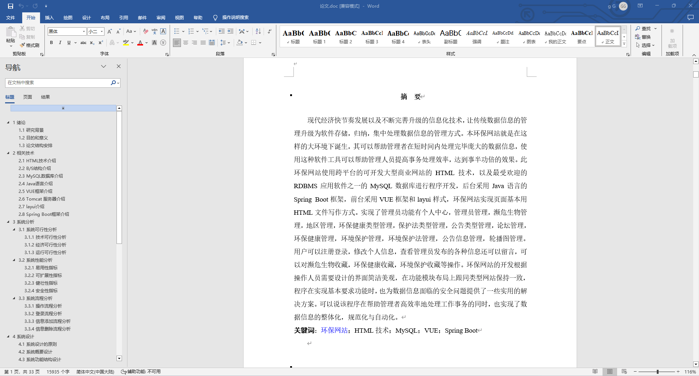
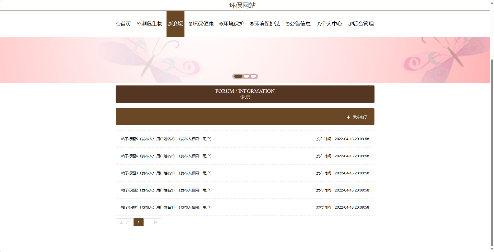
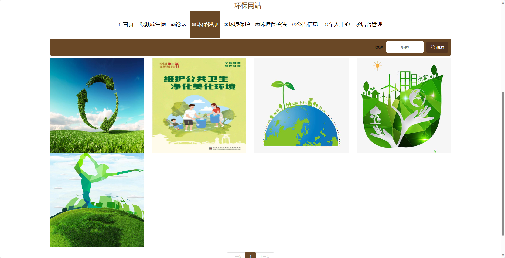
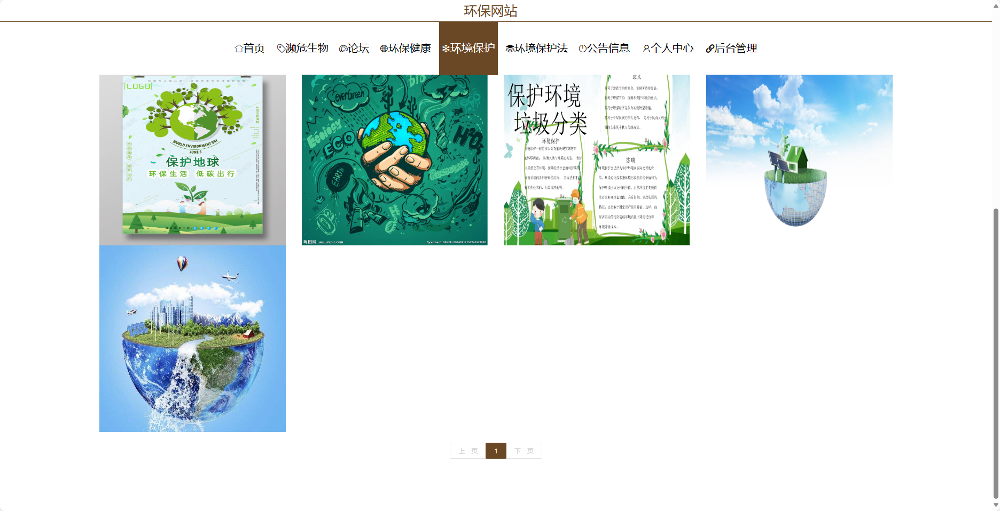
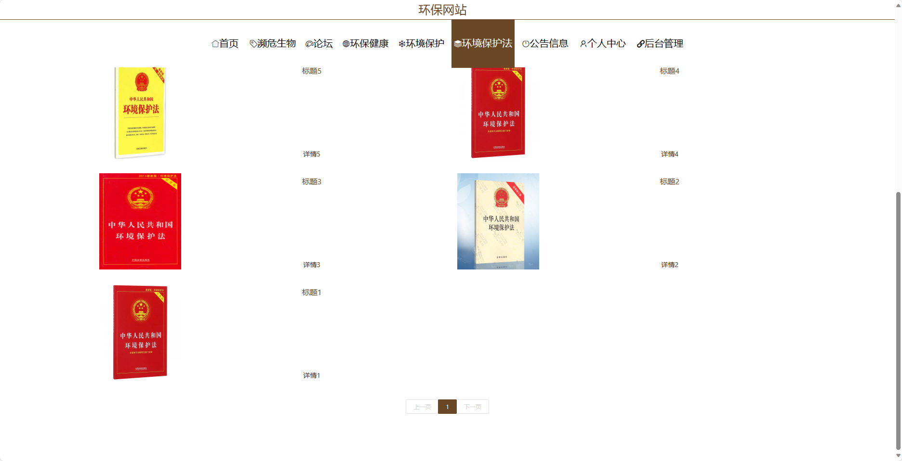
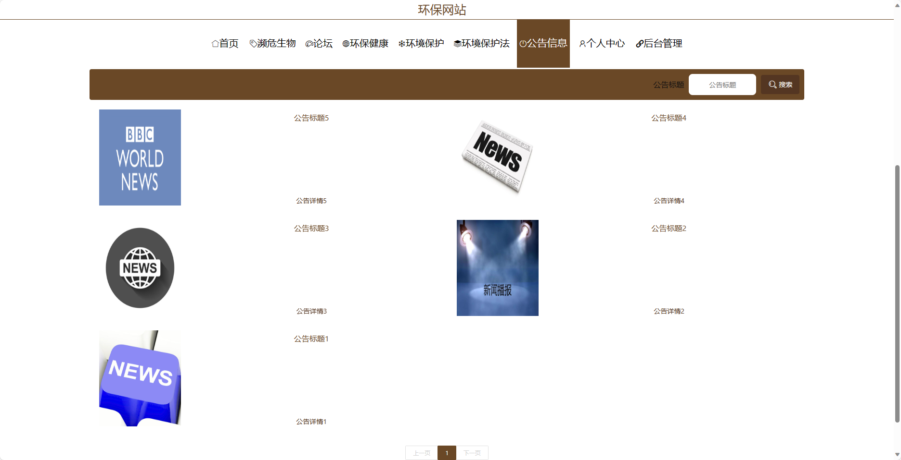
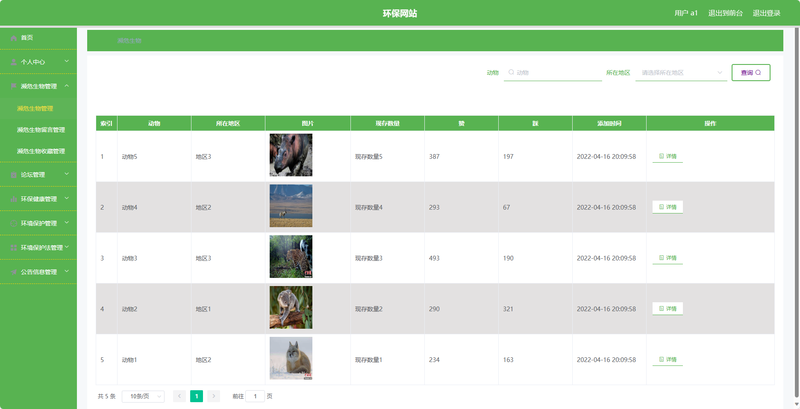
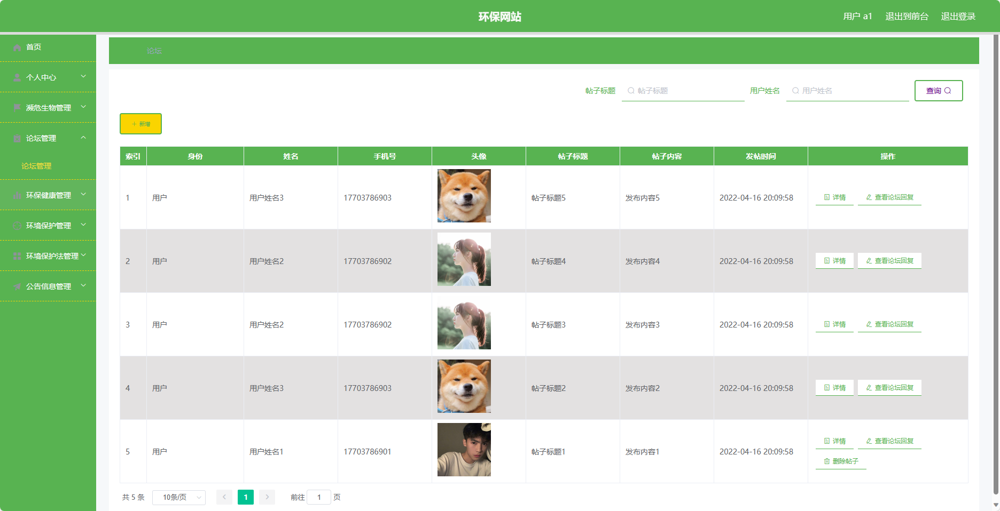

## 基于SpringBoot的环保网站(程序+报告)

###  获取sql数据库文件: 从戎源码网 (https://armycodes.com/) QQ: 386869957 QQ群: 377586148
###  所有系统地址: (https://github.com/YuLin-Coder/AllProjectCatalog) 
###  所有项目以及源代码本人均调试运行无问题 可支持远程安装部署调试、定制修改、代码讲解

## 项目介绍
基于SpringBoot的环保网站，系统包含两种角色：管理员、用户,系统分为前台和后台两大模块，主要功能如下。

### 【管理员】:
1. 个人中心：管理个人信息。
2. 管理员管理：管理系统管理员的账号信息，包括添加、编辑、删除等操作。
3. 濒危生物管理：同用户的濒危生物管理功能。
4. 基础数据管理：管理网站的基础数据，如用户信息、角色权限等。
5. 论坛管理：同用户的论坛管理功能。
6. 环保健康管理：同用户的环保健康管理功能。
7. 环境保护管理：同用户的环境保护管理功能。
8. 环境保护留言管理：管理用户在环保留言板上的留言记录，包括审核、删除等操作。
9. 环境保护收藏管理：管理用户在环保网站上收藏的内容，包括查看、取消收藏等操作。
10. 环境保护法管理：同用户的环境保护法管理功能。
11. 公告信息管理：同用户的公告信息管理功能。
12. 用户管理：管理注册用户信息，包括查看、冻结、删除用户等操作。
13. 轮播图信息：管理网站首页轮播图的信息，包括添加、编辑、删除等操作。

### 【用户】:
1. 个人中心：管理个人信息。
2. 濒危生物管理：管理濒危生物的信息，包括添加、编辑、删除等操作。
3. 论坛管理：管理论坛的帖子和回复，包括审核、删除等操作。
4. 环保健康管理：管理健康相关的文章和资讯，包括添加、编辑、删除等操作。
5. 环境保护管理：管理环境保护的相关信息，包括添加、编辑、删除等操作。
6. 环境保护法管理：管理环境保护相关的法律法规，包括添加、编辑、删除等操作。
7. 公告信息管理：管理网站的公告信息，包括添加、编辑、删除等操作。

### 【前台】:
1. 首页：展示环保网站的最新动态、重要公告等信息。
2. 濒危生物：提供濒危生物的相关信息以及保护措施。
3. 论坛：用户可以在论坛上进行环保话题的讨论和交流。
4. 环保健康：分享环保与健康相关的知识和资讯。
5. 环境保护：介绍环境保护的相关政策和行动。
6. 环境保护法：介绍环境保护相关的法律法规。
7. 公告信息：展示网站的重要公告和通知信息。
8. 个人中心：用户可以管理个人信息、收藏的内容、留言记录等。

## 项目技术
- 编程语言：Java
- 数据库：MySQL
- 项目管理工具：Maven
- 前端技术：HTML、CSS、JavaScript、Jquery、Vue
- 后端技术：Spring、SpringMVC、MyBatis

## 运行环境
- JDK版本：JDK1.8及以上
- 开发工具：IDEA、Ecplise、Myecplise都可以
- 数据库: MySQL5.7及以上
- Maven：maven3.0及以上
- Node：14.14.0及以上

## 运行截图

